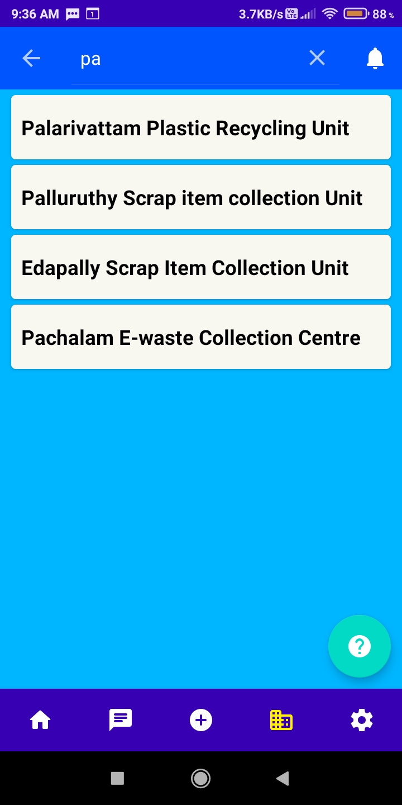
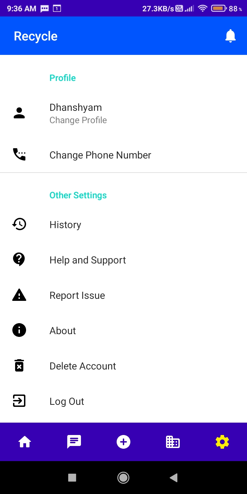

# Recycle_App

## Reuse Recycle and Dispose Properly

This app aims to solve the issue of waste management and encourage users to reuse items or sell it to others who are searching for the same product. Also, the app provides a list of waste disposal/recycling centres. This list of recycling centres are not real and this data is created for this project use only. Users can also chat with each other.
  

## Context
Consumerism has resulted in unnessary purchases. This lack of responsibility from consumer side has resulted in man made waste to skyrocket. Most of the products we purchse can be recycled while other products cannot be recycled. So it is important to ensure that these products at the end of their lifecycle do not reach landfills. Another issue is that many of the items that end up in landfill or waste collection centre are still usable. At the same time there are people who require the same product but cannot afford it.

So it would be better if the consumers have an option to sell their products to others who require the same product. This is not a new concept. Traditionally we used to sell useful itesm to our friends or relatives when we no longer used it. So we just decided to make an application that would solve the issue. Also the application shows a list of recycling centres, waste collection centres. Users can communicate with each other about the price and how the product would be transferred.
  

## Current Status
Initally when I did the project, I did not follow a proper app architechture. Now I am learning MVVM and I have tried to implement it for some of the Fragments. Also I have tried to replace many of the boilerplate code with Jetpack components, Reactive Programming. This is still Work in Progress and code still needs a lot of refactoring. Also I have plans to implement dependency injection in this project. 
  

## App Screenshots

<table>
<tr>
  <th>1) Products Display page</th>
  <th>2) Poducts Details page</th>
  <th>3) User Details page</th>
</tr>
<tr>
  <td></td>
  <td></td>
  <td></td>
</tr>
</table>
  

<table>
<tr>
  <th>4) Chat Page</th>
  <th>5) Messages Page</th>
  <th>6) User Products Page</th>
</tr>
<tr>
  <td></td>
  <td></td>
  <td></td>
</tr>
</table>
  

<table>
<tr>
  <th>7) Add New Product</th>
  <th>8) User Product Details</th>
  <th>9) Recycle Centres List</th>
</tr>
<tr>
  <td></td>
  <td></td>
  <td></td>
</tr>
</table>
  

<table>
<tr>
  <th>10) Recycle Centre Details</th>
  <th>11) Search Products</th>
  <th>12) Search Centres</th>
  <th>13) Settings Page</th>
</tr>
<tr>
  <td></td>
  <td></td>
  <td></td>
  <td></td>
</tr>
</table>
  
